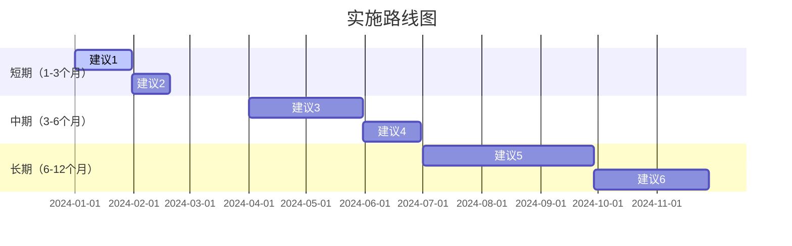

# Auto Research 报告输出模板

## 模板说明

本文档定义了 Auto Research 生成的 Markdown 报告的标准结构和格式规范。所有报告应遵循此模板，确保一致性和可读性。

## 完整模板

```markdown
# {调研主题}

> **调研报告** | 生成时间: {YYYY-MM-DD HH:MM:SS} | Auto Research Skill (QoderWork版)

---

## TL;DR（摘要）

基于对 **{调研主题}** 的深入调研，核心发现如下：

1. **核心结论1**：{简明扼要的最重要发现} - {为什么重要/影响什么}
2. **核心结论2**：{次要但关键的洞察} - {补充说明}
3. **核心结论3**：{补充性的重要信息} - {背景或上下文}

**关键建议**：{1-2句 actionable 的核心建议}

**适用场景**：{该调研结果最适合的应用场景}

**置信度**：{高/中/低} - {简要说明原因}

---

## 关键发现

### 技术视角

#### 发现1: {技术原理和架构}

{详细描述技术原理、架构设计、核心组件等}

**关键要点**：
- 要点1：{具体说明}
- 要点2：{具体说明}
- 要点3：{具体说明}

**支撑证据**：
- [来源1标题](URL) - {相关性说明}
- [来源2标题](URL) - {相关性说明}

**技术架构图**：
```
{如有可能，使用 Mermaid 或其他格式展示架构图}
```

**性能指标**：
| 指标 | 数值 | 测试环境 |
|------|------|----------|
| 指标1 | 值1 | 环境1 |
| 指标2 | 值2 | 环境2 |

---

#### 发现2: {实现细节和优化}

{描述实现细节、优化策略、最佳实践等}

**关键要点**：
- ...

**代码示例**：
```python
#示例代码
def example():
    pass
```

**支撑证据**：
- ...

---

### 业务视角

#### 发现1: {应用场景和商业价值}

{描述主要应用场景、商业价值、市场机会等}

**典型应用场景**：
1. **场景1**：{描述} - {价值}
2. **场景2**：{描述} - {价值}
3. **场景3**：{描述} - {价值}

**商业价值评估**：
- **市场规模**：{数据 + 来源}
- **增长趋势**：{数据 + 来源}
- **盈利模式**：{说明}

**支撑证据**：
- ...

---

#### 发现2: {成本效益分析}

{详细的成本效益分析}

**成本构成**：
| 成本项 | 金额/比例 | 说明 |
|--------|-----------|------|
| 成本1 | 值1 | 说明1 |
| 成本2 | 值2 | 说明2 |

**收益预期**：
- 短期（1年）：{预期收益}
- 中期（3年）：{预期收益}
- 长期（5年）：{预期收益}

**ROI 分析**：
- 投资回收期：{时间}
- 内部收益率（IRR）：{百分比}
- 净现值（NPV）：{金额}

**支撑证据**：
- ...

---

### 竞争视角

#### 发现1: {竞品对比}

{详细的竞品对比分析}

**竞品对比矩阵**：
| 维度 | 我方方案 | 竞品A | 竞品B | 竞品C |
|------|----------|-------|-------|-------|
| 性能 | ⭐⭐⭐⭐⭐ | ⭐⭐⭐⭐ | ⭐⭐⭐ | ⭐⭐⭐⭐ |
| 成本 | ⭐⭐⭐ | ⭐⭐⭐⭐ | ⭐⭐⭐⭐⭐ | ⭐⭐⭐ |
| 易用性 | ⭐⭐⭐⭐ | ⭐⭐⭐ | ⭐⭐⭐⭐⭐ | ⭐⭐⭐⭐ |
| 成熟度 | ⭐⭐⭐ | ⭐⭐⭐⭐⭐ | ⭐⭐⭐⭐ | ⭐⭐⭐ |
| 生态 | ⭐⭐⭐⭐ | ⭐⭐⭐⭐⭐ | ⭐⭐⭐ | ⭐⭐⭐⭐ |

**差异化优势**：
1. **优势1**：{说明} - {为什么是优势}
2. **优势2**：{说明} - {为什么是优势}
3. **优势3**：{说明} - {为什么是优势}

**竞争劣势**：
1. **劣势1**：{说明} - {如何弥补}
2. **劣势2**：{说明} - {如何弥补}

**市场份额**：
- 我方：{百分比}
- 竞品A：{百分比}
- 竞品B：{百分比}
- 其他：{百分比}

**支撑证据**：
- ...

---

### 风险视角

#### 发现1: {技术风险}

{详细的技术风险分析}

**风险清单**：
| 风险项 | 概率 | 影响 | 风险等级 | 缓解措施 |
|--------|------|------|----------|----------|
| 风险1 | 高/中/低 | 高/中/低 | 高/中/低 | 措施1 |
| 风险2 | 高/中/低 | 高/中/低 | 高/中/低 | 措施2 |

**关键技术依赖**：
- 依赖1：{说明} - {替代方案}
- 依赖2：{说明} - {替代方案}

**技术债务**：
- 已知问题：{列表}
- 计划修复时间：{时间线}

**支撑证据**：
- ...

---

#### 发现2: {市场和合规风险}

{市场风险和合规风险分析}

**市场风险**：
- 风险1：{说明} - {应对策略}
-风险2：{说明} - {应对策略}

**合规风险**：
- 法规1：{说明} - {合规要求}
- 法规2：{说明} - {合规要求}

**政策影响**：
- 正面影响：{列表}
- 负面影响：{列表}

**支撑证据**：
- ...

---

## 对比分析

### 方案对比

{根据调研内容，选择最相关的对比维度}

| 维度 | 方案A | 方案B | 方案C | 推荐 |
|------|-------|-------|-------|------|
| **性能** | {描述} | {描述} | {描述} | {方案X} |
| **成本** | {描述} | {描述} | {描述} | {方案X} |
| **复杂度** | {描述} | {描述} | {描述} | {方案X} |
| **成熟度** | {描述} | {描述} | {描述} | {方案X} |
| **可扩展性** | {描述} | {描述} | {描述} | {方案X} |
| **社区支持** | {描述} | {描述} | {描述} | {方案X} |
| **学习曲线** | {描述} | {描述} | {描述} | {方案X} |
| **总体评分** | ⭐⭐⭐⭐ | ⭐⭐⭐⭐⭐ | ⭐⭐⭐ | **方案B** |

**推荐理由**：
{详细说明为什么推荐该方案，综合考虑各维度}

---

### 交叉验证结果

**一致发现**（多个视角都提到的高置信度结论）：

1. **{发现1}**
   - 提及视角：{视角1}、{视角2}、{视角3}
   - 置信度：高
   - 说明：{为什么这个发现重要}

2. **{发现2}**
   - 提及视角：{视角1}、{视角2}
   - 置信度：高
   - 说明：{说明}

**矛盾点**（需要进一步验证的内容）：

1. **{矛盾主题}**
   - 来源A：{观点A}
   - 来源B：{观点B}
   - 可能原因：{分析}
   - 建议：{如何验证}

**证据质量分布**：
- 🔴高置信度：{数量} 项（多个权威来源一致 + 量化数据支撑）
- 🟡 中置信度：{数量} 项（2-3个来源一致或有部分数据支撑）
- 🟢 低置信度：{数量} 项（单一来源或缺乏数据支撑）

**来源多样性**：
-总来源数：{数量}
- 官方文档：{数量}
- 学术论文：{数量}
- 技术博客：{数量}
-行业报告：{数量}
- 其他：{数量}

---

## 场景压力测试

### 边界条件测试

**场景描述**：{调研主题} 在极端条件下的表现

**测试维度**：
- 数据量：极大（10x正常） / 极小（0.1x正常）
- 并发量：极高（100x正常） / 极低（单用户）
- 网络延迟：极高（1000ms+） / 极低（局域网）
- 资源限制：CPU受限 / 内存受限 / 存储受限

**潜在风险**：
1. **{风险1}**
   - 描述：{详细说明}
   - 触发条件：{什么情况下会触发}
   - 影响程度：{高/中/低}
   - 发生概率：{高/中/低}

2. **{风险2}**
   - ...

**缓解措施**：
1. **{措施1}**
   - 实施难度：{高/中/低}
   - 预期效果：{说明}
   - 实施时间：{估计时间}

2. **{措施2}**
   - ...

**风险等级**：🔴 高 / 🟡 中 / 🟢 低

**建议**：{针对边界条件的具体建议}

---

### 异常场景测试

**场景描述**：{调研主题} 在故障和异常情况下的表现

**测试维度**：
- 网络中断：完全断开 / 间歇性断开 / 高丢包率
- 节点故障：单节点故障 / 多节点故障 / 主节点故障
- 数据不一致：脏数据 / 数据丢失 / 数据冲突
- 依赖服务：不可用 / 响应慢 / 返回错误

**潜在风险**：
1. **{风险1}**
   - ...

2. **{风险2}**
   - ...

**容错机制**：
- 机制1：{说明} - {有效性}
- 机制2：{说明} - {有效性}

**恢复策略**：
- 自动恢复：{是否支持} - {恢复时间}
- 手动干预：{需要什么操作} - {预计时间}

**缓解措施**：
1. **{措施1}**
   - ...

2. **{措施2}**
   - ...

**风险等级**：🔴 高 / 🟡 中 / 🟢 低

**建议**：{针对异常场景的具体建议}

---

### 演进场景测试

**场景描述**：{调研主题} 在长期演进中的适应性

**测试维度**：
- 技术升级：版本迭代 / 架构重构 / 技术栈迁移
- 需求变化：功能扩展 / 性能要求提升 / 新场景适配
- 规模扩张：10x / 100x / 1000x
- 组织变化：团队扩大 / 跨团队协作 / 外包合作

**潜在风险**：
1. **{风险1}**
   - ...

2. **{风险2}**
   - ...

**技术债务**：
- 已知债务：{列表}
- 累积速度：{快/中/慢}
- 偿还计划：{说明}

**扩展性评估**：
- 水平扩展：{是否支持} - {限制因素}
- 垂直扩展：{是否支持} - {限制因素}
- 混合扩展：{是否支持} - {最佳实践}

**缓解措施**：
1. **{措施1}**
   - ...

2. **{措施2}**
   - ...

**风险等级**：🔴 高 / 🟡 中 / 🟢 低

**建议**：{针对演进场景的具体建议}

---

## 建议

基于以上分析，提出以下分阶段建议：

### 短期建议（1-3个月）

**优先级：P0（必须执行）**

1. **{建议1标题}**
   
   **行动项**：
   - [ ] 任务1：{具体描述} - 负责人：{角色} -截止时间：{日期}
   - [ ] 任务2：{具体描述} - 负责人：{角色} - 截止时间：{日期}
   
   **理由**：
   {详细说明为什么这个建议重要，引用前面的分析}
   
   **预期效果**：
   - 效果1：{量化指标}
   - 效果2：{量化指标}
   
   **所需资源**：
   - 人力：{人数 x 时间}
   - 资金：{金额}
   - 工具：{列表}
   
   **风险**：
   - 风险1：{说明} - 缓解措施：{说明}
   
   **成功标准**：
   - 标准1：{可衡量的指标}
   - 标准2：{可衡量的指标}

---

**优先级：P1（应该执行）**

2. **{建议2标题}**
   
   **行动项**：
   - ...
   
   **理由**：
   ...
   
   **预期效果**：
   ...

---

### 中期建议（3-6个月）

**优先级：P1（应该执行）**

3. **{建议3标题}**
   
   **行动项**：
   - ...
   
   **理由**：
   ...
   
   **预期效果**：
   ...
   
   **依赖关系**：
   - 依赖于：{短期建议X}
   - 阻塞：{长期建议Y}

---

**优先级：P2（可以执行）**

4. **{建议4标题}**
   
   ...

---

### 长期建议（6-12个月）

**优先级：P2（可以执行）**

5. **{建议5标题}**
   
   **战略意义**：
   {说明这个建议的战略价值和长期影响}
   
   **行动项**：
   - ...
   
   **理由**：
   ...
   
   **预期效果**：
   ...
   
   **风险评估**：
   - 风险1：{说明} - 概率：{高/中/低} - 影响：{高/中/低}

---

**优先级：P3（可选执行）**

6. **{建议6标题}**
   
   ...

---

### 建议优先级矩阵

```
        影响大
          ↑
    P0    |    P1
          |
低 ←------+------→ 高
  可能性  |   可能性
          |
    P2    |    P3
          ↓
        影响小
```

**图例**：
- P0：高可能性 + 大影响 → 必须立即执行
- P1：高可能性 + 中等影响或 中等可能性 + 大影响 → 应该执行
- P2：中等可能性 + 中等影响 → 可以执行
- P3：低可能性或小影响 → 可选执行

---

### 实施路线图



---

### 注意事项

⚠️ **重要提醒**：

1. **结合实际情况调整**
   - 以上建议需结合组织的具体情况（资源、能力、战略）进行调整
   - 建议执行前进行小规模试点验证

2. **定期回顾和调整**
   - 建议每 {时间周期} 回顾一次执行情况
   - 根据市场变化和技术发展及时调整策略

3. **风险管理**
   - 每个建议都有潜在风险，执行前需充分评估
   - 建立监控机制，及时发现问题并调整

4. **资源约束**
   - 考虑人力、资金、时间等资源约束
   - 优先执行 ROI 最高的建议

5. **利益相关者沟通**
   - 执行前与相关利益方充分沟通
   - 获得必要的支持和资源

---

## 参考文献

### 核心参考文献

{按重要性排序，最重要的放在前面}

1. **[来源1标题](URL)**
   - 类型：{官方文档/学术论文/技术博客/行业报告}
   - 作者：{作者名}
   - 发布时间：{日期}
   - 相关性：⭐⭐⭐⭐⭐
   - 引用章节：{说明在报告的哪些部分引用了此来源}

2. **[来源2标题](URL)**
   - 类型：{...}
   - ...

---

### 补充参考文献

3. **[来源3标题](URL)**
   - ...

4. **[来源4标题](URL)**
   - ...

---

### 数据来源说明

**搜索策略**：
- 搜索引擎：{列表}
- 关键词：{列表}
- 时间范围：{起始日期} - {结束日期}
- 语言：{中文/英文/其他}

**筛选标准**：
- 权威性：优先选择官方文档、学术论文、知名媒体
- 时效性：优先选择最近 {时间范围}的内容
- 相关性：根据关键词匹配度和内容质量筛选

**局限性说明**：
- {说明调研的局限性，如语言限制、时间限制、访问限制等}
- {说明可能存在的偏见或盲区}

---

## 附录

### 术语表

| 术语 |定义 | 首次出现位置 |
|------|------|--------------|
| 术语1 | {定义} | {章节} |
| 术语2 | {定义} | {章节} |

---

### 缩略语表

| 缩略语 | 全称 | 说明 |
|--------|------|------|
| API | Application Programming Interface | 应用程序接口 |
| ROI | Return on Investment | 投资回报率 |

---

### 方法论说明

**调研方法**：
- 文献综述：{说明}
- 竞品分析：{说明}
- 专家访谈：{如有，说明}
- 数据分析：{如有，说明}

**分析框架**：
- 技术视角：{使用的框架或方法}
- 业务视角：{使用的框架或方法}
- 竞争视角：{使用的框架或方法}
- 风险视角：{使用的框架或方法}

**质量控制**：
-交叉验证：{说明如何进行交叉验证}
- 多方印证：{说明如何确保结论可靠性}
- 不确定性标注：{说明如何标注不确定的内容}

---

### 版本历史

| 版本 | 日期 | 修改内容 | 作者 |
|------|------|----------|------|
| v1.0 | {日期} | 初始版本 | Auto Research Skill |

---

### 联系方式

如有疑问或需要进一步讨论，请联系：

- **调研负责人**：{姓名/角色}
- **联系方式**：{邮箱/钉钉/其他}
- **反馈渠道**：{如何提供反馈}

---

*本报告由 Auto Research Skill (QoderWork版) 自动生成*

*生成时间：{YYYY-MM-DD HH:MM:SS}*

*报告有效期：{建议的有效期，如"3个月"或"截至下次重大技术更新"}*

```

## 格式规范

### Markdown 语法

1. **标题层级**
   - 使用 `#` 表示一级标题（报告标题）
   - 使用 `##` 表示二级标题（主要章节）
   - 使用 `###` 表示三级标题（子章节）
   - 使用 `####` 表示四级标题（细分内容）

2. **强调**
   -使用 `**粗体**` 强调关键点
   - 使用 `*斜体*` 表示次要强调
   - 避免过度使用强调，保持简洁

3. **列表**
   - 使用 `-` 或 `*` 表示无序列表
   - 使用 `1.` `2.` `3.` 表示有序列表
   - 嵌套列表使用缩进（2或4个空格）

4. **链接**
   - 使用 `[文本](URL)` 格式
   - URL 必须是完整的 http:// 或 https://
   - 避免使用相对链接

5. **代码块**
   - 使用 ```language 包裹代码
   - 指定语言以启用语法高亮
   - 保持代码格式整洁

6. **表格**
   - 使用 Markdown 表格语法
   - 第一行是表头，第二行是分隔线
   - 保持列对齐以提高可读性

7. **引用**
   - 使用 `>` 表示引用块
   - 用于强调重要信息或元数据

###内容规范

1. **语言风格**
   - 使用专业、客观的语言
   - 避免口语化表达
   - 保持语气一致

2. **段落长度**
   - 每段 3-5 句话为宜
   - 避免过长段落（超过10行）
   - 适当使用空行分隔

3. **数据呈现**
   - 优先使用表格展示对比数据
   - 使用图表展示趋势和分布（如支持）
   -所有数据必须标注来源

4. **引用规范**
   - 每个论断必须有出处
   - 优先引用权威来源
   - 避免单一来源依赖

5. **不确定性标注**
   - 对不确定的内容明确标注
   - 使用"可能"、"据推测"、"需要进一步验证"等措辞
   - 说明不确定性的原因

### 视觉规范

1. **Emoji 使用**
   - ✅ 表示完成/正确
   - ❌ 表示失败/错误
   - ⚠️表示警告/注意
   - 🔴 🟡 🟢 表示风险等级
   - ⭐ 表示评分
   - 适度使用，避免过度装饰

2. **分隔线**
   - 使用 `---` 分隔主要章节
   - 增强视觉层次感

3. **空白使用**
   - 章节之间保留足够空白
   - 提高可读性和扫描性

### 文件命名

**格式**：`{主题简化}_{YYYYMMDD_HHMMSS}.md`

**示例**：
- `KV_Cache_通信模式_20240330_105412.md`
- `QUIC协议应用_20240330_110230.md`

**规则**：
-主题简化：去除特殊字符，空格替换为下划线，最多50个字符
- 时间戳：精确到秒，便于版本管理
- 编码：UTF-8

### 保存路径

**默认路径**：`/workspace/output/reports/`

**目录结构**：
```
/workspace/output/
└── reports/
    ├── KV_Cache_通信模式_20240330_105412.md
    ├── QUIC协议应用_20240330_110230.md
    └── ...
```

## 自定义选项

### 调整报告长度

**简短版**（适合快速浏览）：
- 保留：TL;DR、关键发现（精简）、建议（仅P0/P1）
- 删除：详细的支撑证据、附录

**标准版**（默认）：
- 包含所有主要章节
- 适度的细节和证据

**详细版**（适合深度研究）：
- 包含所有章节和附录
- 详细的支撑证据和数据
- 完整的方法论说明

### 调整分析维度

根据调研主题的特点，可以调整分析维度：

**技术类主题**：
- 强化：技术视角、性能分析
- 简化：业务视角、市场分析

**商业类主题**：
- 强化：业务视角、竞争视角、市场分析
- 简化：技术细节

**政策类主题**：
- 强化：风险视角、合规分析、政策影响
- 增加：利益相关者分析

### 添加自定义章节

在 `report_generator.py` 中添加新的章节生成方法：

```python
def generate_custom_section(self) -> str:
    """生成自定义章节"""
    content = "## 自定义章节\n\n"
    content += "{自定义内容}\n\n"
    return content
```

然后在 `generate()` 方法中调用：

```python
self.report_content += self.generate_custom_section()
```

## 质量保证

### 检查清单

在发布报告前，检查以下项目：

- [ ] 所有论断都有出处引用
- [ ] 数据来源清晰标注
- [ ] 不确定性内容已标注
- [ ] 拼写和语法正确
- [ ] 链接有效
- [ ] 表格格式正确
- [ ] 代码块有语法高亮
- [ ] 章节结构清晰
- [ ] 建议具有可操作性
- [ ] 风险和建议对应

### 同行评审

对于重要报告，建议进行同行评审：

1. **技术评审**：由领域专家审核技术准确性
2. **业务评审**：由业务方审核建议的可行性
3. **格式评审**：检查格式规范和可读性

### 版本管理

- 使用 Git 或其他版本控制系统管理报告
- 每次修改创建新版本
- 记录版本历史和修改内容
-保留历史版本供追溯

## 示例报告

完整的示例报告请参考：
- `/workspace/output/reports/example_report.md`

或运行测试命令生成示例：
```bash
python scripts/report_generator.py
```
